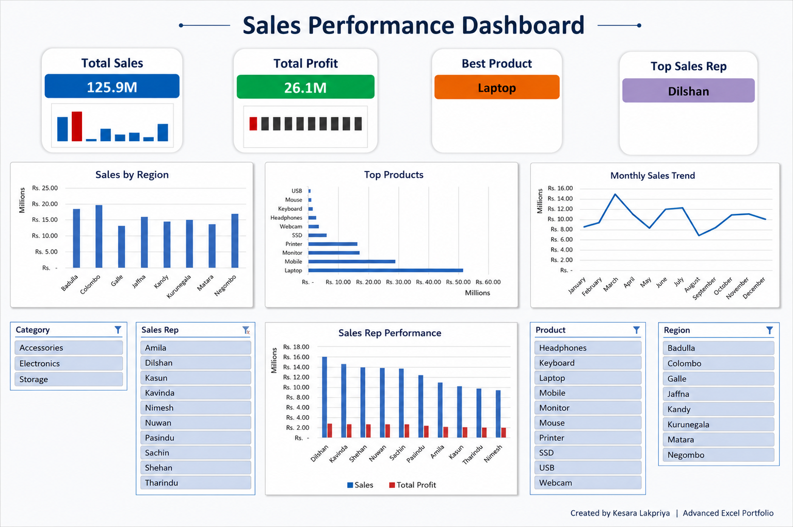

# 📊 Sales Performance Dashboard | Microsoft Excel

## 📌 Project Overview
This project is an interactive Sales Performance Dashboard built using Microsoft Excel.  
It focuses on sales analysis, KPI tracking, business reporting, and data visualization.

## 📷 Dashboard Preview

## 🔑 Key Features
- Total Sales KPI
- Total Profit KPI
- Best Product
- Top Sales Representative
- Sales by Region
- Top Products Analysis
- Monthly Sales Trend
- Sales Representative Performance
- Interactive Slicers

## 🛠 Tools & Techniques Used
- Microsoft Excel
- Pivot Tables
- Pivot Charts
- VLOOKUP
- IFERROR
- Calculated Columns
- Slicers
- KPI Cards
- Dashboard Design

## 📊 Skills Demonstrated
- Data Cleaning
- Data Analysis
- Business Reporting
- Dashboard Development
- Data Visualization
- Sales Performance Analysis

## 📁 Project Files
- `Sales_Performance_Dashboard.xlsx`
- `Image1.png`
- `README.md`

## 👤 Author
**Kesara Lakpriya**

GitHub: `https://github.com/42Kesara`  
